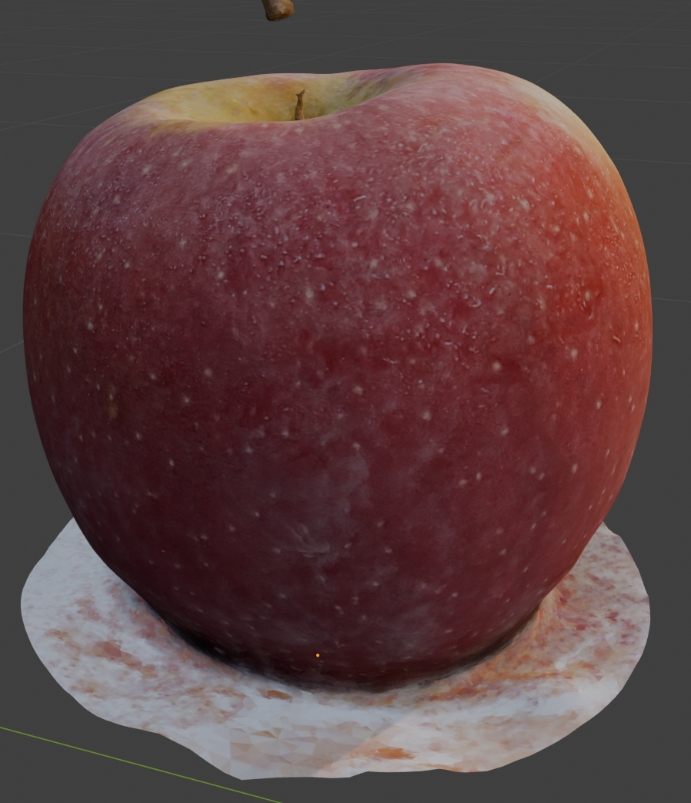
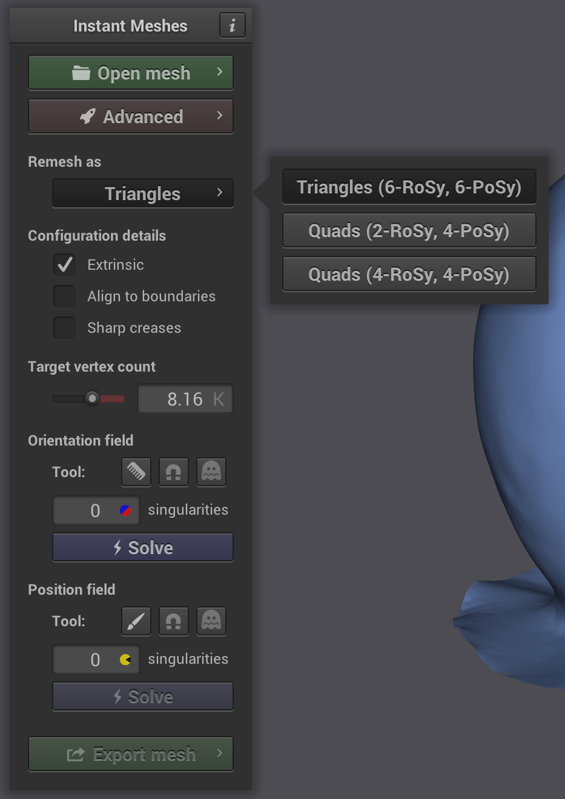
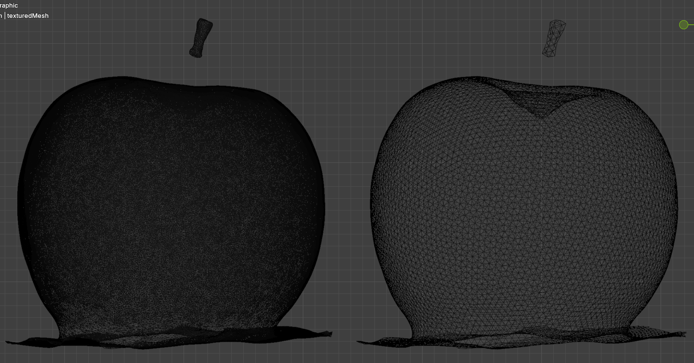
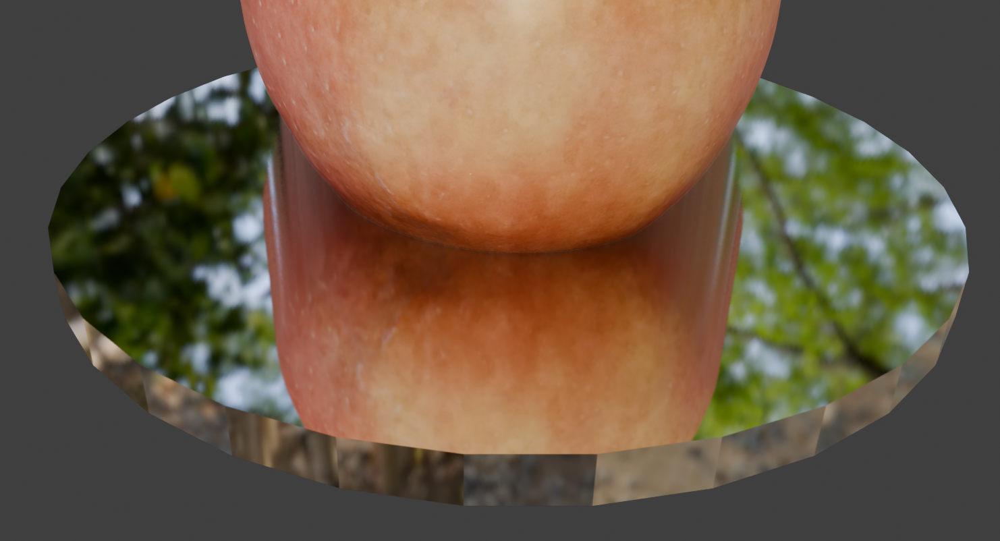
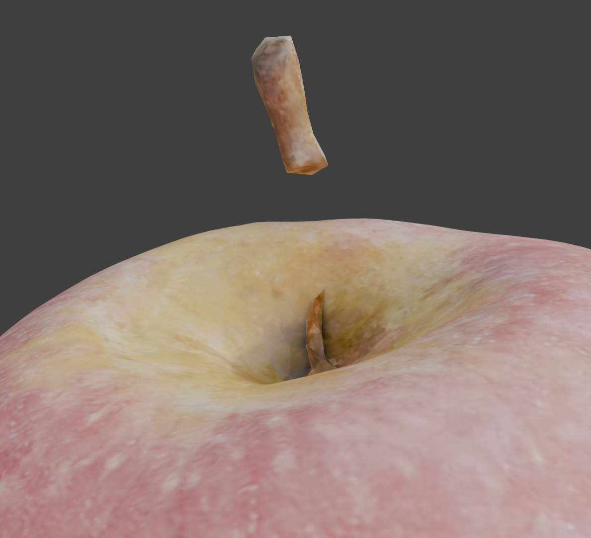
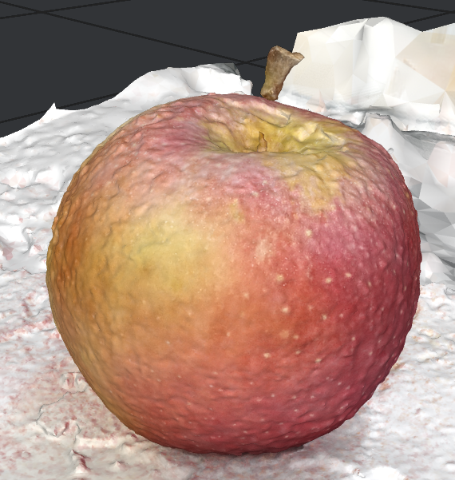

# Relatório Técnico: Pós-processamento no Blender

## Introdução

Este relatório corresponde à segunda etapa do projeto de reconstrução 3D por fotogrametria. Após a geração do modelo 3D inicial no Meshroom, esta etapa concentrou-se no aprimoramento da malha utilizando o software **Blender**, com suporte do software livre **Instant Meshes**. O objetivo foi corrigir imperfeições e otimizar o modelo para visualização, mantendo a fidelidade ao objeto original – uma maçã.

O processo envolveu a análise do material produzido pela equipe do semestre anterior, bem como referências adicionais que serão listadas na seção final. As atividades foram realizadas ao longo de dois dias.

## Objetivos da Edição

- Corrigir a rugosidade exagerada da superfície do modelo  
- Reduzir a complexidade da malha (vértices e faces)  
- Ajustar e simplificar a camada UV  
- Remover artefatos e cores indesejadas do fundo  
- Preparar uma base para visualização da maçã, considerando a ausência de dados na parte inferior  

## Metodologia

### Técnicas Utilizadas no Blender e Instant Meshes

1. **Smoothing da malha no Blender:**  
   A superfície da maçã apresentava rugosidade excessiva. A ferramenta de *smoothing* foi aplicada para suavizar a geometria, resultando em uma aparência mais condizente com a textura real da fruta.  

     
   *Figura 1 - Visualização da maçã após aplicação do smoothing no Blender.*  

2. **Remesh no Instant Meshes com triângulos:**  
   Para reduzir a complexidade da malha, foi utilizado o software **Instant Meshes**. O processo foi configurado com saída em triângulos, utilizando os modos **6-RoSy** e **6-PoSy**, e ajustado para produzir cerca de **8.300 vértices**, valor que corresponde ao modelo final utilizado.  

     
   *Figura 2 - Interface do Instant Meshes com parâmetros de remesh aplicados.*  

3. **Comparação entre malhas de alta e baixa densidade:**  
   A seguir, uma visualização lado a lado das malhas antes e depois da redução de complexidade:

     
   *Figura 3 - À esquerda, malha original densa; à direita, malha otimizada com Instant Meshes.*  

4. **Simplificação da camada UV:**  
   Com a malha otimizada, a camada UV também foi ajustada no Blender para compatibilizar com a nova topologia e manter a qualidade da textura.

5. **Correção do fundo com corte booleano:**  
   Foram identificadas cores avermelhadas no fundo da malha, que não correspondiam ao material da cena original (uma toalha branca), possivelmente causadas por reflexos da própria maçã. Para solucionar, foi feito um **corte booleano com um cubo**, que em seguida foi convertido em um **cilindro metálico refletivo**. Esse objeto passou a servir como base para a visualização da maçã, compensando a ausência de dados na parte inferior.  

     
   *Figura 4 - Base criada em Blender com material de metal polido, simulando fundo refletivo.*  

6. **Preparação para correção do caule:**  
   O caule da maçã permanece com falhas na reconstrução. Já foram pesquisadas abordagens para tratar esse problema, que será resolvido na próxima sprint. A ideia é desenvolver uma técnica reutilizável para outros objetos que apresentem falhas semelhantes.  

     
   *Figura 5 - Exemplo do problema no caule, que será tratado nas próximas etapas.*  

## Resultados

### Antes e Depois (malha)
| Parâmetro         | Antes        | Depois        |
|-------------------|--------------|---------------|
| Vertices          | 130.519      | 8.271         |
| Edges             | 388.643      | 24.602        |
| Faces             | 258.134      | 16.333        |
| Triangles         | 259.134      | 16.333        |

> *Observação: A redução foi realizada exclusivamente com o Instant Meshes, sem aplicação do processo de decimation no Blender.*

### Visualização do Modelo Final  

  
*Figura 6 - Visualização final da maçã com a base refletiva aplicada.*  

## Comparações de Etapas

- **Antes do smoothing:**  
    
  *Figura 7 - Malha antes da aplicação de suavização no Blender.*  

- **Depois do smoothing:**  
    
  *Figura 8 - Malha suavizada, realçando a superfície orgânica da maçã.*  

## Problemas em Aberto

- **Caule danificado:** Ainda sem solução, pendente para a próxima sprint.  
- **Perda de dados da parte inferior:** Solucionada parcialmente com base artificial.  

## Considerações Finais

O uso combinado do Blender e do Instant Meshes permitiu avanços significativos na qualidade do modelo reconstruído. O remesh com controle de topologia, seguido da suavização e ajuste do ambiente de apresentação, resultou em um modelo mais limpo e tecnicamente adequado. A metodologia poderá ser reaproveitada em outros casos similares dentro do projeto.

Os próximos passos incluem a modelagem do caule e testes de estratégias alternativas para lidar com regiões faltantes em outros objetos.

## Fontes e Referências

- [Documentação da equipe de  2024.2]()  
- [YouTube – Meshroom Tutorial Sketchfab](https://www.youtube.com/watch?v=j3lhPKF8qjU)  
- [Photoscanning 100% Free: Complete Meshroom Tutorial | Photogrammetry Course](https://www.youtube.com/watch?v=jI7nd2EQW1w)  
- [Instant Meshes (Github)](https://github.com/wjakob/instant-meshes)  
- [3D Scanning, Reducing Poly Count & Baking Textures for Free | Meshroom, Instant Meshes, Blender](https://www.youtube.com/watch?v=DgUkGKIJ4wQ)  
- [BLENDER 3D - Tutorial definitivo para Iniciantes (Em Português)](https://www.youtube.com/watch?v=QX_D7uhqGfI)  
- [Transfer HIGH POLY details to LOW POLY object in Blender](https://www.youtube.com/watch?v=l8xrSgyfEHs)  

## Arquivos do Projeto

- 🔗 [.blend - Smooth e Retopologize](./other/apple.blend)
- 🔗 [.blend - Simplificação da camada UV](./other/apple_uv.blend)
- 🔗 [.blend - Final](./other/apple_final.blend)
- 🔗 [.obj - Smooth antes de passar por Instant Meshing](./other/apple_smooth.obj)
- 🔗 [.obj - Retopologize](./other/apple_instantmesh.obj)
- 🔗 [.obj - Final](./other/apple_final.obj)
