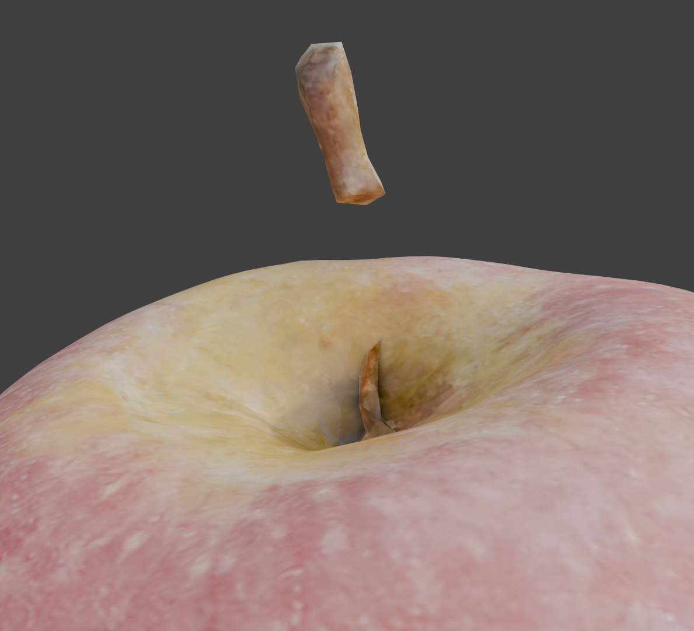
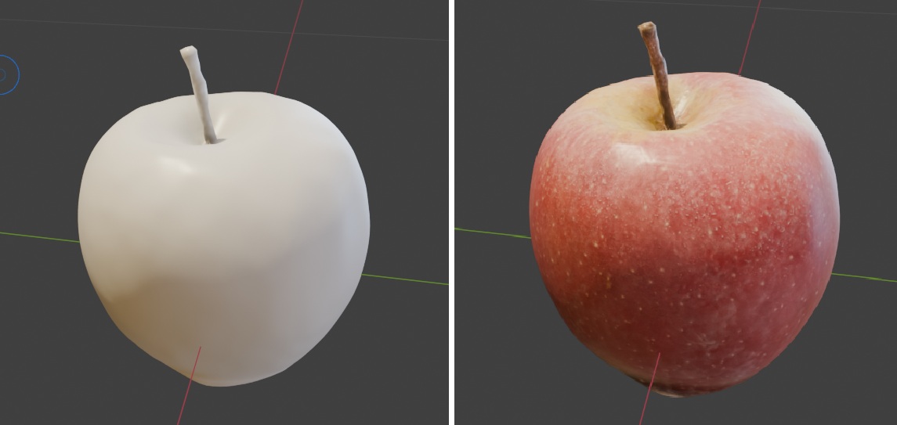
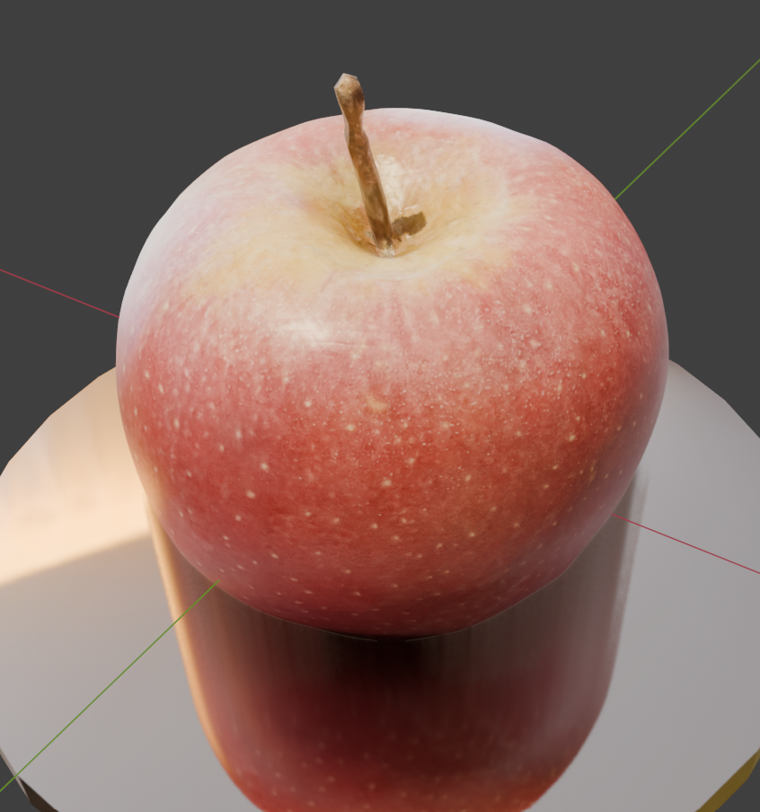

# Relatório Técnico - Blender

## Reconstrução do Caule da Maçã

Este relatório detalha o passo-a-passo realizado para resolver o problema identificado na geração do modelo tridimensional (3D) da maçã durante a sprint 1, onde o caule da maçã apresentou falha na fotogrametria, resultando em partes ausentes. A reconstrução foi realizada utilizando técnicas de modelagem e pintura digital no software Blender.

### Etapas Executadas:

#### 1. Seleção e Preparação do Modelo
- Foi utilizado o arquivo `.obj` simplificado da maçã obtido na sprint 1 como base para os testes.

- Inicialmente, foram apagados os pontos e as faces que obstruíam o caminho para recriação adequada do caule.

#### 2. Criação das Novas Faces
- Utilizou-se o atalho de teclado `F` (Create Segment/Edge/Face) para recriar manualmente as faces faltantes na região do caule.

#### 3. Subdivisão das Faces
- As novas faces criadas foram subdivididas em faces menores para melhor ajuste utilizando a ferramenta "Knife", com o atalho de teclado `K`.

#### 4. Bake das Texturas
- Após a subdivisão das faces, foi realizado novamente o processo de bake das camadas de textura `diffuse` e `normal`, tendo como referência o modelo original da maçã em alta resolução (high poly).
- As imagens resultantes desse bake foram salvas no formato `.png` para posterior utilização.

#### 5. Correção das Texturas
- A correção das texturas nas regiões afetadas pelo remodelamento do caule foi realizada utilizando a ferramenta "Clone" no painel de "Texture Paint".
- Essa etapa permitiu harmonizar as texturas, garantindo continuidade visual entre o caule reconstruído e o restante da maçã.

#### 6. Finalização com Sculpting
- Para garantir um resultado visualmente realista e natural, ferramentas de escultura (sculpting) foram aplicadas sobre a região reconstruída do caule.
- Esta etapa permitiu refinamentos finais, adicionando detalhes e irregularidades que caracterizam um caule real.

### Conclusão

O processo descrito permitiu a reconstrução eficaz e realista do caule faltante na maçã gerada pela fotogrametria, resultando em um modelo 3D visualmente coeso e tecnicamente satisfatório para utilização nas próximas etapas do projeto.

### Referência

- [Tutorial utilizado para referência das técnicas empregadas](https://www.youtube.com/watch?v=_pzTK-LBm3o)

