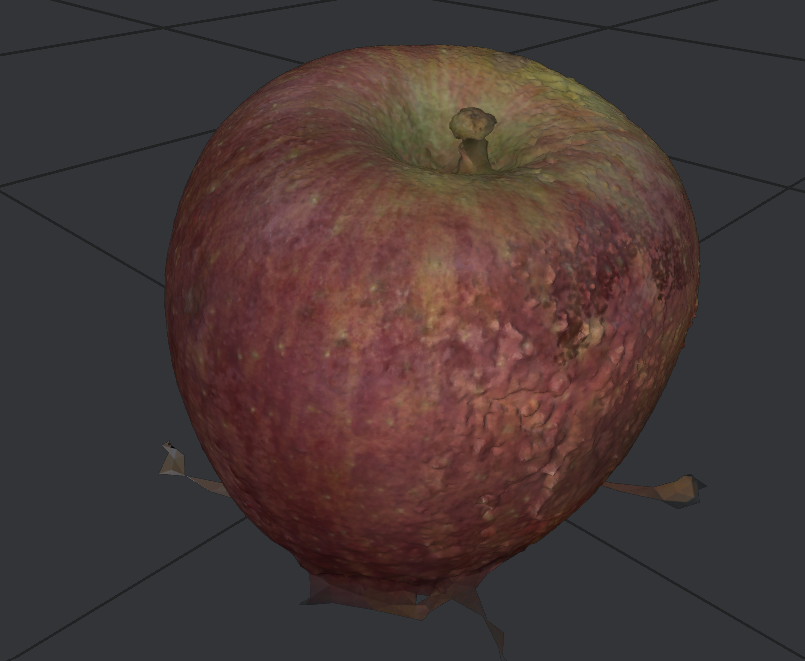
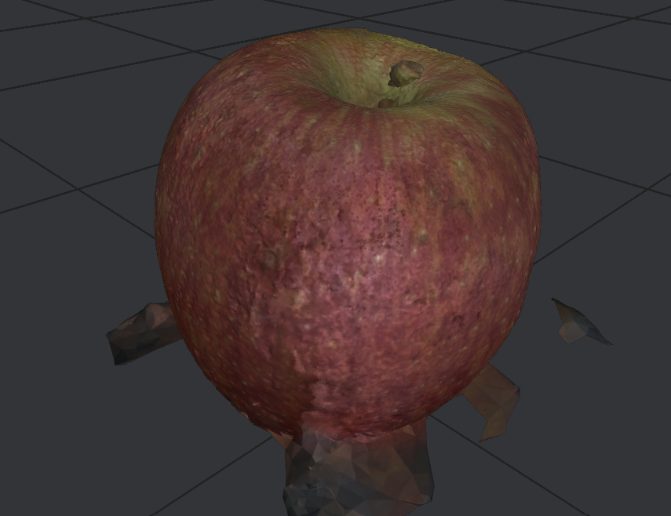
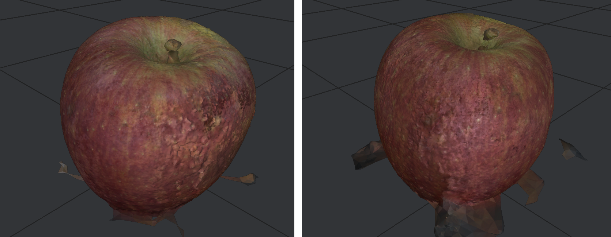

# Relatório Técnico - Refinamento do Processo Fotográfico

Este relatório detalha o procedimento e os resultados obtidos em duas tentativas para refinar o processo fotográfico aplicado na fotogrametria da maçã. O objetivo foi melhorar a qualidade da estrutura e das texturas em comparação com os resultados obtidos na sprint anterior.

## Condições e Configurações Comuns
- Ambas as tentativas foram realizadas durante o período da tarde com iluminação natural indireta.
- As fotos foram capturadas próximas ao objeto, sem o uso de tripé.
- Configurações gerais da câmera:
  - Modo: Manual
  - Distância focal: 28mm
  - Abertura: f/8
  - Tempo de exposição: 1/60s
  - Formato: RAW (ARW)

## Detalhamento das Tentativas

### Tentativa 1
- Número de fotos: 44
- ISO: 1000 (fixo)
- Iluminação: Natural indireta e artificial de lâmpadas no teto
- Resultados obtidos:
  - Estrutura: 43 câmeras, 19.273 pontos
  - Textura: 1.099.085 faces, 2 mapas de textura

### Tentativa 2
- Número de fotos: 42
- ISO: Variável (400 - 2000)
- Iluminação: Natural indireta, lâmpadas no teto e iluminação adicional com caixa Godox acoplada à câmera
- Resultados obtidos:
  - Estrutura: 41 câmeras, 24.277 pontos
  - Textura: 1.267.631 faces, 2 mapas de textura

## Análise Comparativa dos Resultados
- A tentativa 1 apresentou resultados superiores, especialmente na qualidade da textura e na completude do caule da maçã.
- A variabilidade do ISO na tentativa 2 provavelmente causou inconsistências visuais e resultou em problemas mais evidentes na textura.
- Além da textura, observou-se que na tentativa 1 o caule da maçã ficou completo e bem definido, ao contrário da tentativa 2 que apresentou um caule incompleto, semelhante à falha da sprint anterior.

## Considerações sobre o Processo
- O não uso do tripé, embora tenha agilizado o processo de captura, dificultou o conforto do operador e prejudicou a consistência do registro fotográfico.
- Um aspecto positivo foi a redução considerável das sobras de digitalização em comparação com a sprint anterior, atribuída principalmente à maior proximidade das fotos ao objeto.

## Conclusão
Para futuras tentativas, recomenda-se o uso fixo do ISO, preferencialmente baixo, e o uso de tripé para garantir maior rigor e consistência nas fotografias, mantendo-se a proximidade já estabelecida para otimizar a qualidade da digitalização.

